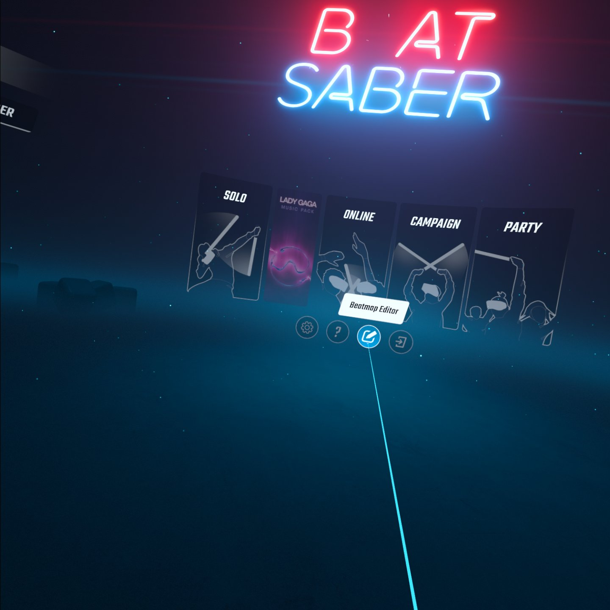

# Level Editor+++

**Edit Levels on Quest!**

# Features:

- Easily edit existing beatmaps and make them your own!

- Includes the 1.22.1 update of the PC version to create and edit arc and chain maps, aka V3 maps!

# How to use

- Install the qmod from [releases](https://github.com/ArtemisE1Tara/LevelEditor---/releases)

- Thats it!

## Credits

* [zoller27osu](https://github.com/zoller27osu), [Sc2ad](https://github.com/Sc2ad) and [jakibaki](https://github.com/jakibaki) - [beatsaber-hook](https://github.com/sc2ad/beatsaber-hook)
* [raftario](https://github.com/raftario)
* [Lauriethefish](https://github.com/Lauriethefish), [danrouse](https://github.com/danrouse) and [Bobby Shmurner](https://github.com/BobbyShmurner) for [this template](https://github.com/Lauriethefish/quest-mod-template)
